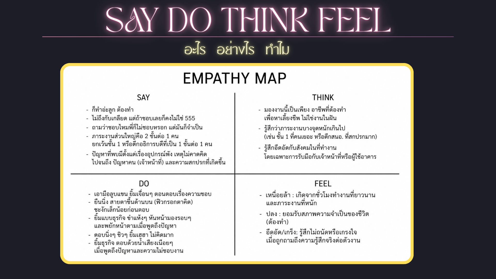

# Interview Script

>คำถามนี้ตั้งขึ้นเพื่อสอบถามแม่บ้านประจำอาคาร/หอพัก เพื่อทำความเข้าใจลักษณะการทำงานในแต่ละวัน ปัญหาและอุปสรรคที่พบระหว่างการทำงาน รวมถึงความรู้สึกและประสบการณ์ต่าง ๆ ที่เกิดขึ้นจริงจากการทำงาน และนำข้อมูลที่ได้มาวิเคราะห์ปัญหา ความต้องการ และหาแนวทางในการแก้ไขปัญหาที่เหมาะสม

---

## What How Why, say-do-think-feel

---

## User Persona

---

## Journey Map

---

## Point of View (POV)

### แม่บ้านประจำอาคาร/หอพักที่ต้องทำงานหนัก 6–7 วันต่อสัปดาห์ ต้องการอุปกรณ์ที่พร้อมใช้และการทำงานที่เหมาะสม รวมถึงการได้รับความเข้าใจจากผู้ใช้อาคาร เพราะอุปกรณ์ที่ไม่พร้อม ภาระงานที่หนัก และการขาดความเข้าใจจากผู้ใช้อาคาร ทำให้แม่บ้านเหนื่อยและอึดอัด แต่ยังต้องทำงานต่อเพราะไม่สามารถปฏิเสธงานได้
---

### Initial PoV statement

---

#### User

แม่บ้านประจำอาคาร/หอพักที่ต้องทำงานหนัก 6-7 วันต่อสัปดาห์

#### Needs

ต้องการให้มีอุปกรณ์ที่พร้อมใช้ งานไม่หนักเกินไป และคนที่มาใช้อาคารให้เกียรติและเข้าใจคนทำงานมากขึ้น

#### Insight

เพราะลำบากใจที่จะปฏิเสธงานเนื่องจาก ความจำเป็นทางเศรษฐกิจแม้จะรู้สึกเหนื่อย หรืออึดอัดใจกับปัญหาเรื่องคนและการทำงาน แต่ก็ต้องสู้และทำหน้าที่ต่อไป

---

## IDEATE

## ระดมไอเดียเพื่อปรับปรับคุณภาพการทำงานของแม่บ้าน

## ผลลัพธ์ที่จับต้องได้

## Final Selected Idea

---

## Prototype

### คำอธิบาย

1. เลือก role หรือบทบาทหน้าที่เพื่อเข้าสู่หน้าระบบของ role ตนเอง
2. ลงชื่อเข้าใช้บัญชีของตนด้วย user และ password ที่กำหนดไว้
3.
    - 3.1 (สำหรับ role แม่บ้าน) เช็คตารางเวลา, รายละเอียดการทำงานของตน ผ่านหน้าจอที่แสดงผลและทำเครื่องหมายในช่องที่กำหนดสำหรับงานนั้น ๆ เมื่องานเสร็จสิ้น หรือกดปุ่มยื่นขอลาหากมีเหตุจำเป็น
    - 3.2 (สำหรับ role นายจ้าง) เช็ครายละเอียดการทำงานของแม่บ้านแต่ละคนว่าเรียบร้อยดีหรือไม่ ในแต่ละช่วงเวลาแบบ real-time ผ่านหน้าจอแสดงผล

---

## Test Scripts

### วัตถุประสงค์การทดสอบ

ตรวจสอบว่า Prototype "Daily Work Checklist" ใช้งานง่ายหรือไม่ และตอบโจทย์ปัญหาของแม่บ้านและผู้ที่เกี่ยวข้อง (นายจ้าง/เจ้าหน้าที่อาคาร) จริงหรือไม่

### คำแนะนำก่อนเริ่มทดสอบ (พูดกับผู้ทดสอบ)

> "วันนี้จะให้คุณลองใช้แอปต้นแบบที่ช่วยจัดการงานประจำวันของแม่บ้านนะคะ ไม่มีคำตอบถูกหรือผิด อยากให้คุณคิดออกเสียงระหว่างทำด้วยว่าคุณกำลังคิดอะไรอยู่ค่ะ"

### Task ที่ให้ผู้ทดสอบทำ

1. เลือกบทบาทผู้ใช้งาน (Employer หรือ Housekeeper) แล้วลองเข้าสู่ระบบ
2. เปิดดู "ตารางเวลาทำงาน" (Time Table) ของวันนี้
3. เปิดหน้า "Check Worklist" แล้วลองติ๊กงานที่ทำเสร็จแล้ว
4. ลองหาว่าจะแจ้งวันหยุด (Day off) ได้จากตรงไหน
5. สรุปให้ฟังว่าหน้าจอไหนที่เข้าใจง่าย/ยากที่สุด เพราะอะไร

### คำถามหลังทดสอบ (Post-test Interview)

- หน้าจอไหนที่ทำให้คุณสับสนที่สุด?
- ตัวหนังสือ/ปุ่มใหญ่พอสำหรับคุณไหม?
- ฟีเจอร์ checklist ช่วยให้จำงานได้ดีขึ้นจริงไหม?
- มีอะไรที่คุณคาดหวังจะเห็นแต่ไม่มีในแอปนี้?
- ให้คะแนนความง่ายในการใช้งาน 1-5 พร้อมเหตุผล

---

## Feedback Matrix from Test

| ผู้ทดสอบ | สิ่งที่ทำงานได้ดี | ปัญหาที่พบ | ข้อเสนอแนะ | ความรุนแรง |
| :--- | :--- | :--- | :--- | :---: |
| ป้าลัดดา (52) | ชอบที่ติ๊กงานเสร็จแล้วเห็นทันที รู้สึกอุ่นใจว่างานไม่ตกหล่น | ตัวหนังสือเล็กไป มองไม่ค่อยชัด | ขยายฟอนต์ / เพิ่มปุ่มขยายขนาดตัวอักษร | สูง |
| ลุงประสิทธิ์ (61) | เข้าใจการสลับ role Employer/Housekeeper ได้เร็ว | ไม่มั่นใจว่ากดติ๊กแล้วข้อมูลถูกบันทึกจริงหรือไม่ | เพิ่ม pop-up ยืนยัน "บันทึกสำเร็จ" | กลาง |
| ป้านิตยา (68) | ชอบไอเดีย QR Code แจ้งอุปกรณ์ชำรุด | ไม่เคยใช้สมาร์ทโฟนสแกน QR มาก่อน ทำเองไม่เป็น | ทำวิดีโอ/ภาพสอนวิธีสแกน หรือมีปุ่มแจ้งแบบข้อความแทน | สูง |
| พี่เมย์ (24) | ใช้งานคล่อง เข้าใจ flow การ login และ checklist เร็ว | อยากให้มีการแจ้งเตือนเมื่อใกล้ถึงเวลาต้องทำงานบางอย่าง | เพิ่มระบบแจ้งเตือนอัตโนมัติ | ต่ำ |
| น้องนนท์ (17) | ชอบดีไซน์เรียบง่าย ไม่ซับซ้อน | หาไม่เจอว่าจะแจ้งวันหยุดยังไง (ปุ่ม day off ไม่เด่นพอ) | ย้ายปุ่ม "day off" ให้เห็นชัดขึ้น หรือทำเป็นแท็บแยก | กลาง |

---

## What to do next from Test Feedback

### ประเด็นที่ต้องแก้ไข (เรียงตามความรุนแรง)

1. **ปัญหาด้านการเข้าถึง (Accessibility)**
   ฟอนต์เล็ก และผู้ใช้สูงอายุไม่คุ้นชินกับการสแกน QR Code → กระทบผู้ใช้กลุ่มหลัก (แม่บ้านอายุ 50–68 ปี) โดยตรง

2. **ความไว้ใจในระบบ (Trust / Feedback loop)**
   ผู้ใช้ไม่แน่ใจว่าการกดติ๊กงานถูกบันทึกจริงหรือไม่ ต้องมี visual confirmation ที่ชัดเจน

3. **Navigation / Findability**
   ฟีเจอร์ day off หาไม่เจอ ต้องปรับ Information Architecture ให้ปุ่มสำคัญเด่นขึ้น

4. **Nice-to-have**
   ระบบแจ้งเตือนอัตโนมัติ (จากพี่เมย์ ซึ่งเป็นกลุ่มผู้ใช้ที่อายุน้อยกว่าและคล่องเทคโนโลยีมากกว่า)

### Mode ที่ต้องกลับไปทำต่อ

ทีมควรกลับไปสู่ **Ideate → Prototype (Iterate)** เฉพาะจุด ไม่ใช่เริ่มใหม่ทั้งหมด เพราะแนวคิดหลัก (Daily Work Checklist) ยังตอบโจทย์ได้ดี เพียงแต่ต้องปรับรายละเอียดด้าน UI/UX ให้เหมาะกับผู้ใช้สูงอายุมากขึ้น

---

## Next Mode(s) Based on User Feedback

จากฟีดแบ็กที่ได้ ทีมควร **iterate กลับไปที่ขั้น Prototype** อีกรอบ (ไม่ใช่ Empathize หรือ Define ใหม่) เพราะ:

- ปัญหาที่พบส่วนใหญ่เป็นปัญหาเชิง **Interaction Design** (ขนาดตัวอักษร, ตำแหน่งปุ่ม, การยืนยันการบันทึก) ไม่ใช่ปัญหาที่ตัว Insight หรือ POV Statement ผิดพลาด → **ไม่จำเป็นต้องย้อนกลับไป Empathize/Define**
- ควรทำ **Low-fidelity iteration** ก่อน โดยเน้น 3 เรื่อง:
  1. เพิ่มขนาดตัวอักษรและปุ่ม
  2. เพิ่ม visual feedback เมื่อกดติ๊กงานสำเร็จ
  3. ทำปุ่ม "แจ้งวันหยุด" ให้เด่นขึ้นในหน้าแรก
- หลังจากปรับแล้ว ควรกลับเข้าสู่ **Test อีกรอบ (Usability Testing Round 2)** กับกลุ่มผู้ใช้อายุมากเป็นหลัก เพื่อยืนยันว่าปัญหาการเข้าถึงได้รับการแก้ไขจริง ก่อนจะพัฒนาเป็น Mid/High-fidelity prototype ต่อไป

---
