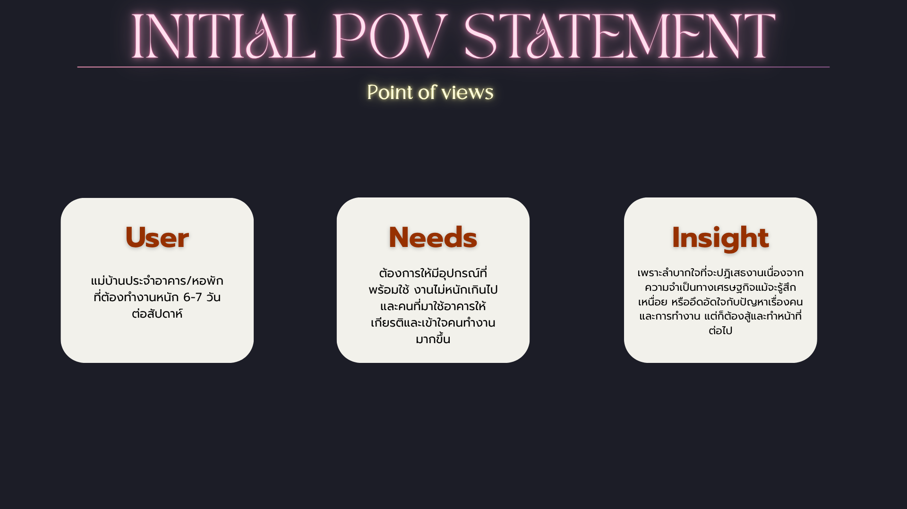

# Point of View

> แม่บ้านประจำอาคาร/หอพักที่ต้องทำงานหนัก 6–7 วันต่อสัปดาห์ ต้องการอุปกรณ์ที่พร้อมใช้และการทำงานที่เหมาะสม รวมถึงการได้รับความเข้าใจจากผู้ใช้อาคาร เพราะอุปกรณ์ที่ไม่พร้อม ภาระงานที่หนัก และการขาดความเข้าใจจากผู้ใช้อาคาร ทำให้แม่บ้านเหนื่อยและอึดอัด แต่ยังต้องทำงานต่อเพราะไม่สามารถปฏิเสธงานได้
